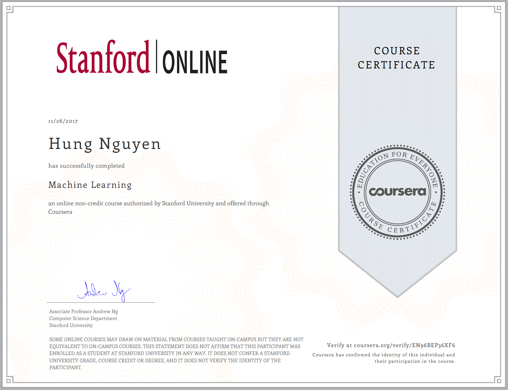
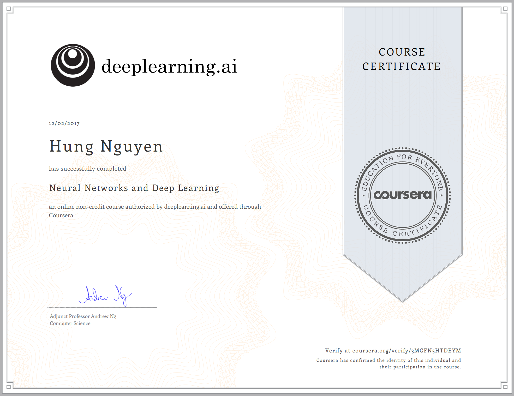
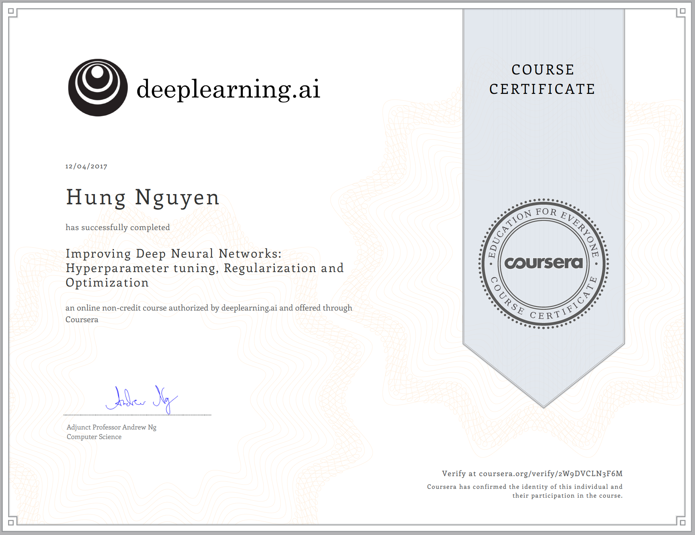

My name is Hung Nguyen. I am studying Computer Science at Hanoi University of Science and Technology in Ha Noi city, Vietnam. Because of my deep passion in technology, I always learning materials relative to technologies on the Internet and study from them in my free time. Although I am a computer science student, I am also interested in other fields related to computer, especially state-of-the-art fields including artificial intelligence, machine learning, the Internet of Things,...
My nearest career goal is to become an all-round engineer, who is capable of doing everything from research to product deployment. I would like to develop my career in data science field, become a full-stack data scientist, which coincides to my nearest career goal.
My experience in Information Technology:

- Machine Learning
- Deep Learning
- Web Development
- Mobile Development

What else do you need?

### My history course
- Machine Learning Certificate:

- Neural Network and Deep Learning:

- Optimization and Hyperparameters:
